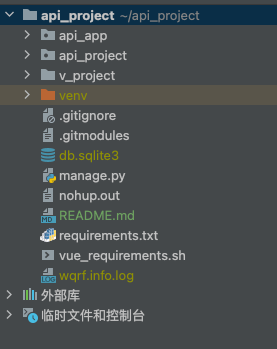

# Pressure

## 准备Python环境

- 安装Python>=3.10
- 安装依赖
    - pip3 install -r requirements.txt
- 安装vue环境(最好是不通过下方命令，自己手动安装，避免重复安装)
    - sh vue_requirements.sh

## 首次启动项目

- 初始化及打包前端项目(在前端项目v_project目录下执行下方命令)
- 注：如果该目录为空，需要在github上将前端v_project项目down下来后，将里面的内容复制到该目录下
    - 下载前端依赖
      ```
      npm install
      注：执行完后v_project目录下会新增node_modules目录，即代表成功
      ```

    - 打包前端项目
      ```
      npm run build
      注：执行完后v_project目录下会新增dist目录，即代表成功
      ```

- 初始化后端服务（在项目根目录下即api_project目录下执行下方命令）
    - 启动后端服务
      ```
      python3 manage.py runserver
      ```
    - 创建后台数据库
      ```
      python manage.py migrate
      ```
    - 创建超级管理员
      ```
      manage.py createsuperuser
      ```

- 首次启动项目后，后续再启动项目只需要执行"启动后端服务"的命令即可

## 项目结构


